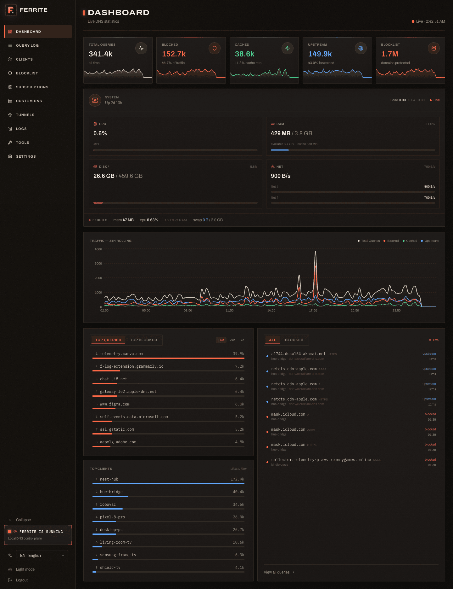
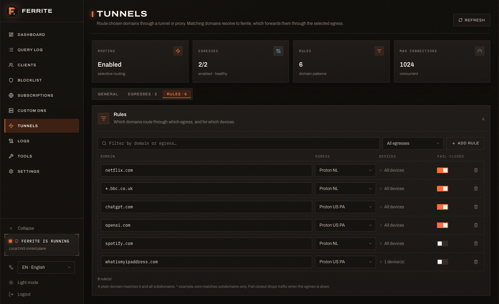
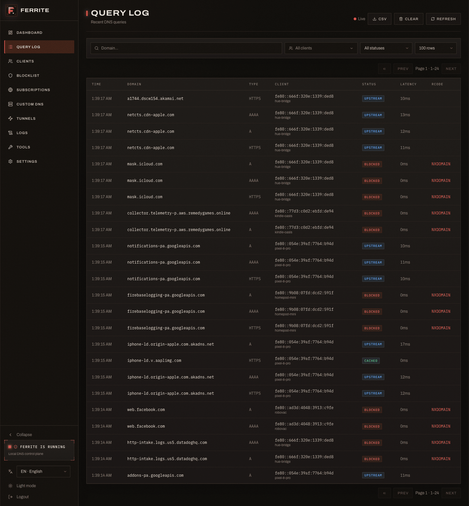
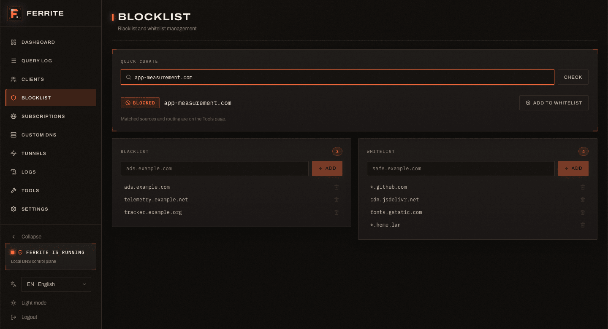
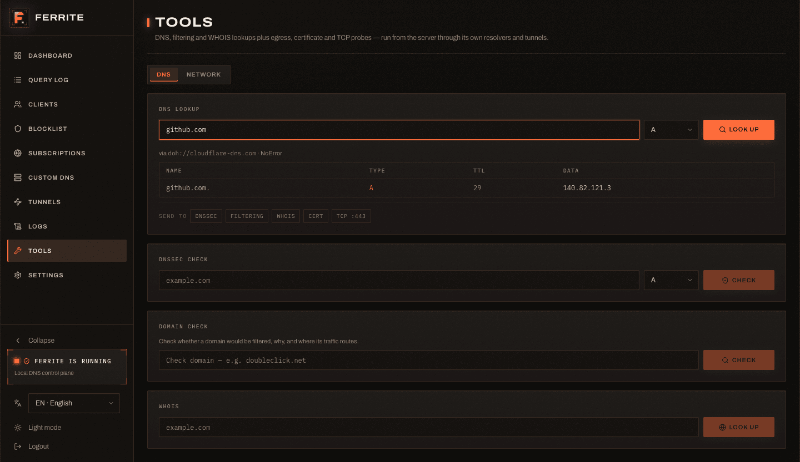

# Ferrite Web UI

React/Vite control panel for Ferrite, a DNS sinkhole and local-network DNS
server. The web UI talks to the Ferrite HTTP API through same-origin `/api`
requests and can be run either through Vite during development or as static
files served by the Ferrite server.

## Screenshots

Captures live in [`screenshots/`](screenshots/), rendered from real (anonymized)
API data using the harness.


_Live dashboard — counters, block rate, 24h chart, top domains, system metrics._


_Selective routing — per-device rules through Direct / SOCKS5 / WireGuard / DPI-evasion egresses._


_Query log with domain / client / status / time filters._


_Why-blocked — which list or rule matched, and the whitelist entry that exempts a domain._


_Built-in DNS lookup (nslookup) and WHOIS._

## What It Includes

- Live dashboard with query counters, block rate, 24h charts, top domains,
  top blocked domains, clients, recent queries, and system metrics.
- Query log with filters for domain, client, status, and time ranges.
- Client list and manual aliases.
- Blacklist and whitelist management.
- Subscription list management with per-list refresh and refresh-all actions.
- Custom DNS records for `A`, `AAAA`, and `CNAME`.
- Selective routing (Tunnels): manage egresses (Direct, SOCKS5, WireGuard,
  DPI-evasion) and domain rules, with live egress health and a buffer-size speed
  calculator.
- Live server logs viewer (in-memory, delta-polled, per-level exclude filters).
- Diagnostic tools: DNS lookup (nslookup) and WHOIS, plus a why-blocked domain
  check that shows which list or rule matched.
- Runtime settings for auth, DNS TTLs, log ignore patterns, log retention, API
  bind address, cache sizing, and the served `web_dir`.
- Server and web update checks/actions.
- Password/session-token login flow, light/dark theme, and a localized UI
  (English, Ukrainian, Spanish, German, French).

## Stack

- React 19
- React Router 7
- TypeScript 6
- Vite 8
- Tailwind CSS 4
- Recharts
- i18next / react-i18next
- lucide-react icons

## Requirements

- A recent Node.js runtime with Corepack (bundled with Node) to provision the
  pinned pnpm from the `packageManager` field.
- A running Ferrite server for real API data.

## Quick Start

Install dependencies (Corepack provisions the pinned pnpm automatically):

```bash
corepack enable   # once per machine
pnpm install
```

Run the Vite dev server and proxy `/api` to a local Ferrite backend:

```bash
VITE_API_TARGET=http://127.0.0.1:8080 pnpm dev
```

Open the URL printed by Vite, usually:

```text
http://localhost:5173
```

The app itself always fetches `/api/...`. In development, Vite proxies those
requests to `VITE_API_TARGET`. If `VITE_API_TARGET` is not set, the current
default is `http://192.168.1.10:80`.

Restart `pnpm dev` after changing `VITE_API_TARGET`; Vite reads it at server
startup.

## Scripts

```bash
pnpm dev      # start Vite with HMR
pnpm build    # create production files in dist/
pnpm preview  # serve dist/ locally with Vite
pnpm lint     # run ESLint
```

## Serving Through Ferrite

Build the static bundle:

```bash
pnpm build
```

During development, point the running Ferrite server at this repo's `dist/`
folder:

```bash
curl -s -X PATCH http://localhost:8080/api/settings \
  -H 'Content-Type: application/json' \
  -d '{"web_dir":"/absolute/path/to/ferrite/web/dist"}'
```

`web_dir` is hot-patchable. Set it to `null` to return to Ferrite's default web
asset directory:

```bash
curl -s -X PATCH http://localhost:8080/api/settings \
  -H 'Content-Type: application/json' \
  -d '{"web_dir":null}'
```

Ferrite serves static UI files from `~/.local/share/ferrite/web/` by default.
The backend can also update installed UI assets with:

```bash
curl -s -X POST http://localhost:8080/api/update/web
```

## CI/CD

This repo uses GitHub Actions workflows under `.github/workflows/`.

`ci.yml` runs on `main` pushes and pull requests:

```text
pnpm install --frozen-lockfile -> pnpm run lint -> pnpm run build -> validate dist.tar.gz
```

`release.yml` runs when a semver tag is pushed:

```bash
git tag v0.1.1
git push origin v0.1.1
```

The release workflow builds the app and publishes `dist.tar.gz` to the GitHub
release for that tag. GitHub exposes the uploaded asset's SHA256 digest in the
release UI and API, so no companion checksum asset is needed. The archive
intentionally contains a top-level `dist/` directory because Ferrite's updater
accepts either a `dist/` folder or files at the archive root.

The release publisher uses GitHub's built-in `${{ github.token }}` with workflow
`contents: write` permission. It avoids Actions artifacts so releases are
self-contained.

Ferrite web release assets are published from `syntlyx/ferrite-web`. The server
release assets live in `syntlyx/ferrite-server`.

## API Contract

The backend contract lives in:

```text
../server/API.md
```

Frontend API code is organized by domain under `src/api/`:

```text
src/api/client.ts    shared fetch wrapper, auth token, error handling
src/api/types.ts     frontend TypeScript view of backend payloads
src/api/stats.ts     dashboard and system stats
src/api/queries.ts   query log
src/api/clients.ts   clients and aliases
src/api/blocklist.ts blacklist, whitelist, domain checks
src/api/lists.ts     subscription lists
src/api/dns.ts       custom DNS records
src/api/settings.ts  runtime settings
src/api/updates.ts   server/web update adapter
```

When the backend changes an endpoint, update `../server/API.md`,
`src/api/types.ts`, the relevant `src/api/*.ts` module, and the page that owns
the UI behavior in the same slice.

## Project Layout

```text
src/
  api/          typed API wrappers
  components/   shared layout, feedback, and UI primitives
  hooks/        local React hooks
  i18n/         UI translations (en, uk, es, de, fr)
  lib/          DNS labels, formatting helpers, class utilities
  pages/        route-level screens
  providers/    theme and toast providers
  App.tsx       routes, auth gate, top-level providers
  main.tsx      React entry point
```

Routes:

```text
/           Dashboard
/queries    Query log
/clients    Clients and aliases
/blocklist  Blacklist / whitelist
/lists      Subscription lists
/dns        Custom DNS records
/tunnels    Selective routing (egresses + rules)
/logs       Live server logs
/tools      DNS lookup, WHOIS, why-blocked, diagnostics
/settings   Runtime settings and updates
/login      Password login
```

## Auth Notes

`GET /api/auth` is used on app load to decide whether the UI can enter the
protected shell. `POST /api/auth` returns a 24h session token when password auth
is enabled. The frontend stores that token in localStorage as `ferrite_token`
and sends it as:

```text
Authorization: Bearer <token>
```

Any `401` response clears the token and redirects to `/login`.

## Development Notes

- Keep browser-facing behavior in pages/components and backend payload details
  in `src/api/`.
- Prefer adapting backend response shape in the owning API module when it makes
  page code simpler. `src/api/updates.ts` is the existing example.
- Add new visible strings to every locale file under `src/i18n/` (en, uk, es, de, fr).
- The dashboard polls `GET /api/stats/summary` frequently, so avoid adding extra
  dashboard requests unless the backend contract requires it.
- Production builds are static; runtime API routing is same-origin `/api`.

## Troubleshooting

- **The UI loads but API calls fail in development:** set
  `VITE_API_TARGET=http://127.0.0.1:8080` or the real Ferrite API origin, then
  restart `npm run dev`.
- **Login keeps returning to `/login`:** the token may be expired or invalid.
  Clear `localStorage.ferrite_token` and log in again.
- **Production page says the web UI is not installed:** build the app and point
  Ferrite at `dist/` with `web_dir`, or install/update web assets via
  `POST /api/update/web`.
- **A settings save restarts the backend:** some settings are persisted and
  require a server restart. The backend documents those fields in
  `../server/API.md`.
